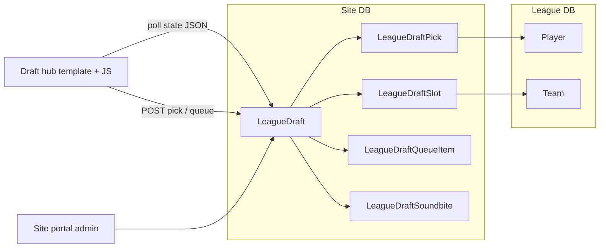

# Draft Hub (per league site)

## Context

- **Undrafted pool today:** [`undrafted_prospects`](app/routes/main.py) uses NHL/BOWL draft + org-rights exclusions and a single max age from [`undrafted_prospects_max_age`](app/config.py) with age “as of” [`season_age_reference_date`](app/services/seasons.py) (Oct 1 of season start year). Your rules use **Sep 15 / Dec 31** anchors and **min + max**; the hub will use **admin-configurable** anchors and ages with **defaults** matching your spec per league slug (`bowl-cap` / `bowl-fantasy` vs `bowl-historical`).
- **Existing Draft History:** [`/draft`](app/routes/main.py) + [`draft_history.py`](app/services/draft_history.py) reads **FHM-imported** [`Draft` / `DraftPick`](app/models.py). Per your choice, the hub lives on a **separate route** and does not replace that data source.
- **No WebSockets in repo:** use **short-interval polling** (e.g. 2–3s while draft is live) to a small JSON state endpoint.
- **GM identity:** [`GmLeagueMembership`](app/site_models.py) (`user_id`, `league_slug`, `team_id`) gates who may submit a pick for the on-clock team.
- **Schema pattern:** site tables live in [`app/site_models.py`](app/site_models.py); binds use `db.create_all()` in [`app/__init__.py`](app/__init__.py) — new models require deploy note to run app once or apply equivalent SQLite migrations on PythonAnywhere.

## Architecture (high level)

## 1. Eligibility engine (shared with undrafted logic)

- **New service** (e.g. [`app/services/draft_hub_eligibility.py`](app/services/draft_hub_eligibility.py)):
  - Reuse the same **drafted** and **org rights** filters as `undrafted_prospects` (same subqueries / helpers as in [`main.undrafted_prospects`](app/routes/main.py) — consider extracting a small `undrafted_prospect_candidate_ids(session)` or query builder in one place to avoid drift).
  - **Age:** implement `_age_as_of(birth_date, as_of: date) -> int | None` (same math as `_player_age_years` in `main.py`) with **two reference dates** from draft settings:
    - **Min rule:** player must be ≥ `min_age_years` by `(timeline_year, min_month, min_day)` (defaults: Cap/Fantasy **Sep 15**; Historical **Dec 31**).
    - **Max rule:** player must be ≤ `max_age_years` by `(timeline_year, max_month, max_day)` (defaults: Cap/Fantasy **Dec 31** max 20; Historical **Dec 31** max 21).
  - **`timeline_year`:** set by **admin per draft** (default suggestion: current season `start_year` from `get_current_season()` when the draft is created). Used only for eligibility cutoffs, not for wall-clock “when we draft.”
  - **Per-site draft timing (manual only):** each `LeagueDraft` row is scoped to one `league_slug`, so Cap, Fantasy, and Historical each have **independent** drafts. **`status` moves `setup` → `live` only when the admin clicks Go live** (no server-side auto-start). Optionally the admin may set **`scheduled_start_at`** (UTC, nullable) **purely for display** on the hub (“Draft night: …”) — it does **not** open the room or start the clock; empty means show a generic “Waiting for commissioner to start” message.

## 2. Site DB models (new tables)

Add to [`app/site_models.py`](app/site_models.py) (names indicative):

| Model | Role |
|--------|------|
| `LeagueDraft` | One row per draft event: `league_slug`, `name`, `status` (`setup` / `live` / `completed`), optional **`scheduled_start_at`** (UTC, **display-only** for “when we’re planning to draft”; not tied to any automation), `rounds`, `timer_seconds` (normal clock), `empty_queue_timer_seconds` (used when on-clock GM has **no** queue entries — admin-set default e.g. 120), eligibility fields (min/max years + month/day for each anchor), **`timeline_year`** (admin), `current_slot_index` or `current_overall`, `pick_started_at`, `pick_deadline_at` (UTC), optional `completed_summary_json` |
| `LeagueDraftSlot` | Ordered slots: `overall`, `round`, `team_id` (int, matches league `Team.id`), `forfeited`, `notes` (trades / explanations) |
| `LeagueDraftPick` | Immutable pick log: `overall`, `round`, `team_id`, `player_id`, `source` (`gm` / `auto_queue` / `admin`), `picked_by_user_id`, `created_at` |
| `LeagueDraftQueueItem` | Per-user queue: `league_draft_id`, `user_id`, `player_id`, `sort_order` — only players still eligible and undrafted in **this** draft |
| `LeagueDraftSoundbite` | `league_draft_id`, `display_name`, `stored_filename` (randomized server name), `mime_type`, `created_at` |

Indexes: `(league_slug, status)`, `(league_draft_id, overall)`, queue `(league_draft_id, user_id, sort_order)`.

## 3. Routes and UI

- **Dedicated page name:** The product-facing name is **Draft Hub** — use it for ``, main heading (`<h1>`), and the nav label. URL can remain `GET /draft-hub` (readable and distinct from `/draft` Draft History).
- **Public + GM hub:** e.g. `GET /draft-hub` in [`app/routes/main.py`](app/routes/main.py) (or a thin [`app/routes/draft_hub.py`](app/routes/draft_hub.py) blueprint registered per app) — renders a league-themed layout (reuse CSS variables / partials from existing league templates). While `status == setup`, if **`scheduled_start_at`** is set, show it as **informational only** (formatted for display, e.g. site default or UTC-labeled); if unset, show a neutral waiting message. **Pick/timer disabled until admin sets `live`.**
- **JSON state:** `GET /draft-hub/api/state` — current clock, on-clock team, visible order slice, recent picks, eligible count (optional summary), soundbite list metadata (no large blobs).
- **GM actions (POST, CSRF):** `pick` (only if `membership.team_id == slot.team_id` and draft `live`), `queue_add` / `queue_remove` / `queue_reorder` (only from current eligible pool and not already picked).
- **Timer expiry:** On state read or a dedicated `POST /draft-hub/api/tick` (idempotent, rate-limited): if `now > pick_deadline_at` and pick not recorded, resolve: **auto** from head of that team’s GM queue (if any); else apply **empty_queue_timer_seconds** by extending deadline **once** per slot (or go straight to admin “pending” — document chosen behavior; recommend: extend once then mark **missed** for admin to assign) — finalize exact policy in implementation comments.
- **Archive:** `GET /draft-hub/archive` or `GET /draft-hub/archive/<id>` for completed drafts (this is the “Draft-History” analogue for league-run drafts; **not** wired into FHM `draft.html`).

**Sticky banner navigation:** The league chrome uses a **sticky** [`site-header`](app/static/css/site.css) (`position: sticky; top: 0`). Add a primary nav link **Draft Hub** in [`app/templates/base.html`](app/templates/base.html) inside `#main-nav` (same row as **Draft History** is ideal — e.g. immediately after `Draft History`) pointing to `url_for('main.draft_hub')` (or the chosen endpoint name). This satisfies “link in the sticky banner” for every league-mounted site.

Optionally add a short cross-link on [`draft.html`](app/templates/draft.html) (FHM Draft History) to **Draft Hub** for discoverability.

## 4. Admin (site portal)

Extend [`app/routes/site_portal.py`](app/routes/site_portal.py) (and templates) with a **Draft Hub** section for site admins:

- Create / clone draft; optionally set **`scheduled_start_at`** for GM-facing display only; set **rounds**, **timer**, **empty-queue timer**, **eligibility** (years + anchor dates), **`timeline_year`** (eligibility year, unrelated to display datetime).
- **Go live:** **only** path from `setup` → `live` is admin **Go live** / **Start draft** (no `auto_start`, no background job opening the room).
- **Draft order editor:** CRUD slots (team pick order), mark forfeited, edit notes — supports trades and forfeitures without touching FHM imports.
- **Force pick / undo last pick** (guarded, audit-logged if you already use [`AdminAuditLog`](app/site_models.py)).
- **Soundbites:** `POST` multipart upload → validate extension/size (e.g. mp3/wav/ogg, max ~2MB) → save under `instance/draft_soundbites/<league_slug>/<draft_id>/` with a **random filename**; DB stores display name + path fragment; serve via a **dedicated download/play route** that checks admin or “draft live” visibility (avoid open static directory listing).

## 5. Post-draft “winners / losers”

- At **complete** time, compute a **pre-draft board** from the **opening** eligible pool: sort by a transparent formula (e.g. primary `overall_potential`, tie-break `overall_ability`, then name) and assign each player a **board rank** 1..N.
- For each **completed pick**, define **surplus** = `board_rank_selected - expected_rank_for_slot` (invert sign so “better than expected” is positive — exact sign documented in code).
- **Team score** = sum of surplus over all picks (skip forfeited / admin-skipped slots as neutral).
- **Top 3 / bottom 3 teams** by team score; store in `completed_summary_json` and render on archive page.
- **Caveat in UI:** “Heuristic based on ratings at draft time — not predictive of real performance.”

## 6. Engagement ideas (optional follow-ups)

- **Pick ticker / “best available”** strip using board rank vs remaining players.
- **Commissioner announcements** (short text broadcast in state JSON).
- **Per-pick “grade”** reaction (A–F) from other GMs only — stored for fun, not scoring.
- **Streak badges** (e.g. “on the clock within 30s” three times).
- **Discord webhook** hook on each pick (if you already have Discord integration patterns in [`app/services/discord_events.py`](app/services/discord_events.py)).

## 7. Security and correctness

- All mutating routes: **login required**, **CSRF**, **league_slug** from app config matches membership.
- **Race on pick:** use a single transaction: lock draft row or check `current_overall` unchanged + `pick_deadline_at` still valid before insert pick and advance clock.
- **Eligible list:** exclude `player_id` already in `LeagueDraftPick` for this draft.

## 8. Files likely touched

- New: `app/services/draft_hub_eligibility.py`, `app/services/draft_hub_state.py` (clock + transition), optional `app/routes/draft_hub.py`
- [`app/site_models.py`](app/site_models.py) — models
- [`app/__init__.py`](app/__init__.py) — blueprint register if split
- [`app/routes/main.py`](app/routes/main.py) or new route module — hub + API
- New templates: `draft_hub.html`, `draft_hub_archive.html`, fragments for three-column layout
- [`app/routes/site_portal.py`](app/routes/site_portal.py) + portal templates — admin CRUD + uploads
- [`app/templates/base.html`](app/templates/base.html) — **Draft Hub** in sticky `main-nav`
- Optional refactor: tiny shared helper from `undrafted_prospects` for “undrafted + no rights” query

## 9. Deploy / ops

- After deploy, ensure **site** SQLite gets new tables (`create_all` on startup or one-time maintenance).
- Document **backup** of `instance/draft_soundbites/` with site DB.
- PythonAnywhere: confirm upload size limits and WSGI timeout for admin uploads.
